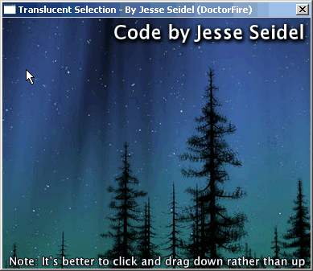



## Translucent Selection Box

### Description

This mimics the translucent selection box of Windows XP, only I made mine white. You can change the color of the selection box by changing the picturebox's backcolor to the color that you want the selection box. This uses the AlphaBlend api, so it can be used on all versions of Windows that support it.
 
### More Info
 

             |
---                |---
**Submitted On**   |2005-05-30 13:49:16
**By**             |[Jesse Seidel](https://github.com/Planet-Source-Code/PSCIndex/blob/master/ByAuthor/jesse-seidel.md)
**Level**          |Beginner
**User Rating**    |5.0 (15 globes from 3 users)
**Compatibility**  |VB 6\.0
**Category**       |[Graphics](https://github.com/Planet-Source-Code/PSCIndex/blob/master/ByCategory/graphics__1-46.md)
**World**          |[Visual Basic](https://github.com/Planet-Source-Code/PSCIndex/blob/master/ByWorld/visual-basic.md)
**Archive File**   |[Translucen2015218222006\.zip](https://github.com/Planet-Source-Code/jesse-seidel-translucent-selection-box__1-66346/archive/master.zip)

